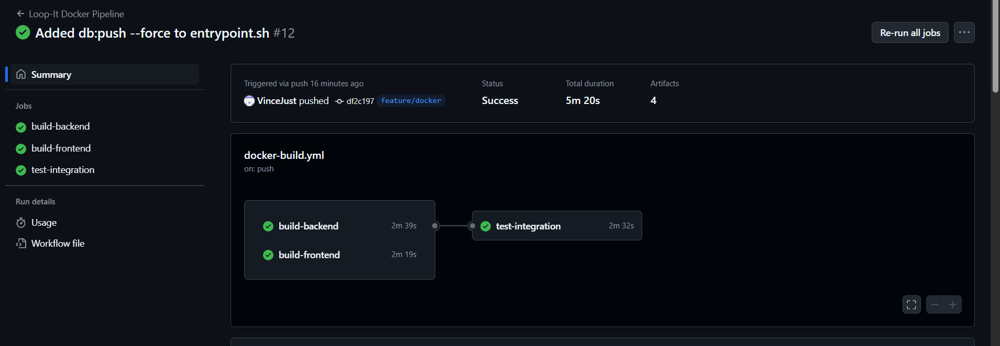

# Projekttagebuch – 03.07.2025 – Vin
## Heutige Hauptaufgabe(n) - Was war das Ziel heute?
- Docker CI/CD Pipeline debuggen und zum Laufen bringen
- Frontend Healthcheck-Probleme beheben
- Reverse Proxy zwischen Frontend und Backend konfigurieren
- Database Migration Issues in CI/CD Pipeline lösen

## Fortschritt & Ergebnisse - Was habe ich konkret geschafft?
- Docker CI/CD Pipeline vollständig implementiert mit Build/Test/Integration Jobs
- Frontend Healthcheck Problem identifiziert und behoben (.dockerignore blockierte dist/)
- nginx Reverse Proxy mit URL-Rewriting konfiguriert (/api/* → Backend)
- Alle Container-Services laufen stabil mit funktionierenden Healthchecks
- Production-ready Docker Setup mit Multi-Stage Builds
- Backend /api/health Route hinzugefügt für Reverse Proxy Kompatibilität
- Database Migration Problem gelöst mit drizzle-kit push --force
- GitHub Actions Pipeline läuft erfolgreich grün durch alle Tests

## Herausforderungen & Blockaden - Wo hing ich fest?
- Frontend Container wurde permanent "unhealthy" wegen fehlendem /health endpoint
- .dockerignore schloss dist/ aus und verhinderte Frontend-Deployment
- nginx Reverse Proxy URL-Mapping zwischen /api/health und Backend /health
- Container-Timing in GitHub Actions (Backend braucht 90s+ warmup Zeit)
- Auth-Endpoint gab 500 Error wegen fehlender users Tabelle in Datenbank
- drizzle-kit push fragte interaktiv nach Bestätigung und wählte "No, abort"

## Was ich heute gelernt habe - Eine kleine, konkrete Erkenntnis oder neues Wissen:
- docker-compose --wait wartet auf erfolgreiche Healthchecks aller Services
- drizzle-kit push --force umgeht interaktive Abfragen in CI/CD Umgebungen
- Backend-Routen müssen explizit für Reverse Proxy Pfade definiert werden
- PostgreSQL "relation does not exist" bedeutet meist fehlgeschlagene Migration

## Plan für morgen - Was ist der nächste logische Schritt?
- Docker Setup pflegen und best practices festhalten
- K8s, Monitoring und Logging für Container planen